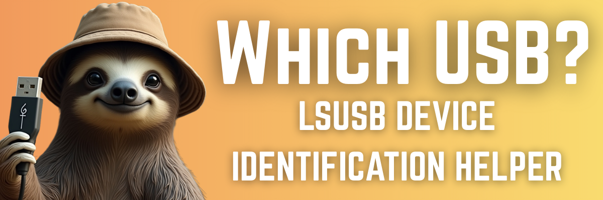
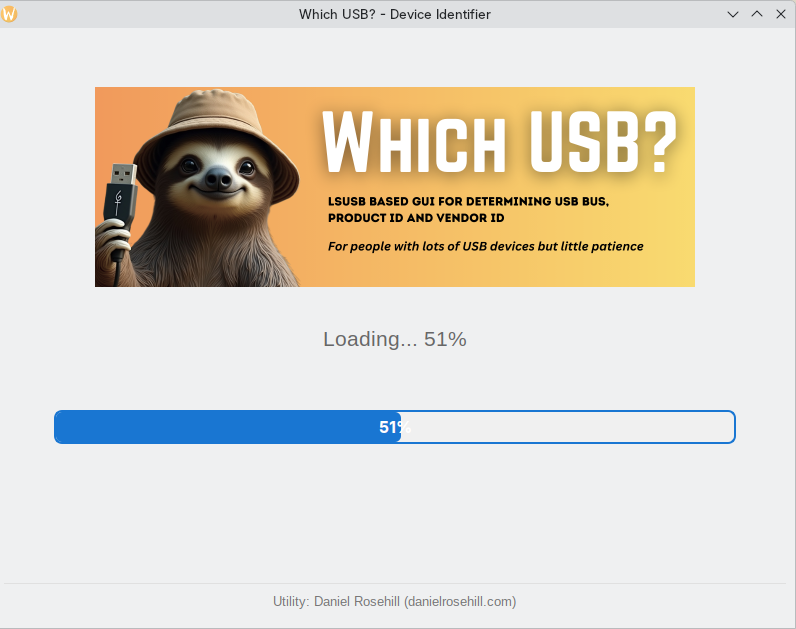
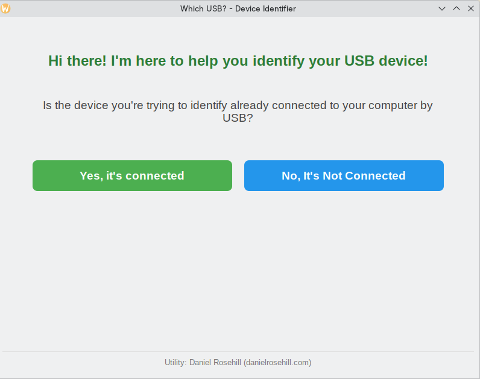
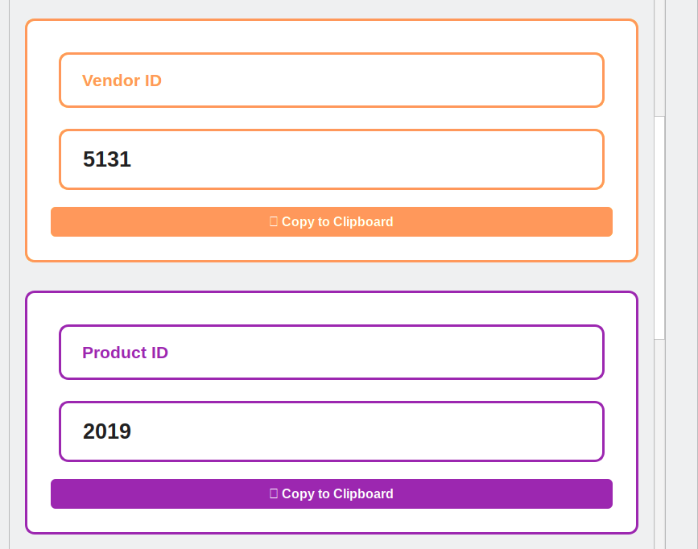

# Which USB?



## Features

- Identify newly connected or disconnected USB devices
- Works with any USB device (keyboards, mice, storage, etc.)
- Simple interactive interface
- No installation required (just Python 3 and lsusb)

## Requirements

- Linux (uses `lsusb` command)
- Python 3.6+
- Root access (recommended for complete device visibility)

## Installation

1. Clone this repository or download the `which-usb` script
2. Make it executable:
   ```bash
   chmod +x which-usb
   ```
3. (Optional) Move it to your PATH for easy access:
   ```bash
   sudo mv which-usb /usr/local/bin/
   ```

## Usage

Run the script:
```bash
./which-usb
```

Or with root privileges (recommended for best results):
```bash
sudo ./which-usb
```

### How It Works

1. Choose your workflow:
   - **Option 1**: Start with the device disconnected, then connect it when prompted
   - **Option 2**: Start with the device connected, then disconnect it when prompted

2. Follow the on-screen instructions to capture the USB device states

3. The tool will compare the before and after states and display the differences







## CLI vs. GUI Comparison Table


## Example Output

```
=== Which USB Device? ===
This tool helps identify USB devices by comparing connection states.

Choose a workflow:
1. Start with device disconnected (I'll connect it when prompted)
2. Start with device connected (I'll disconnect it when prompted)
3. Exit

Enter your choice (1-3): 1

Please make sure the device is disconnected.
Press Enter when ready to capture the first state...
Captured 12 devices.

Now please connect the device and press Enter when done...

Captured 13 devices.

Newly connected device(s):
  1. Logitech, Inc. Unifying Receiver (Vendor: 046d, Product: c52b)
```

---

